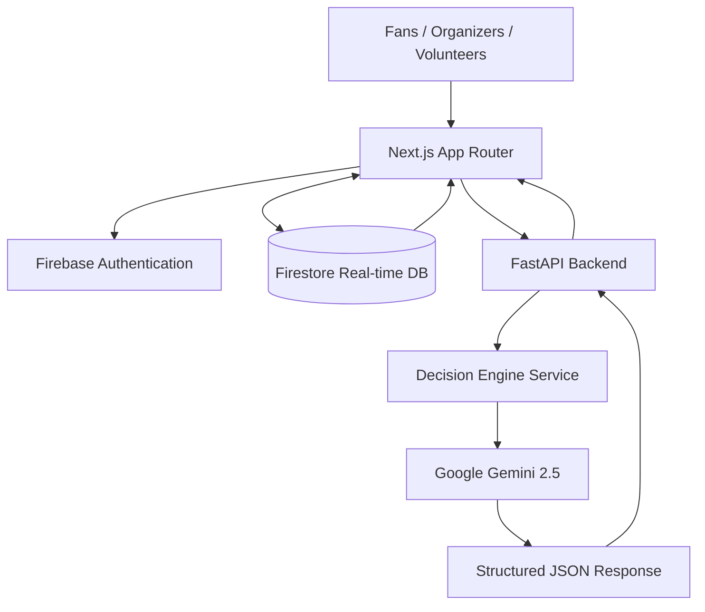
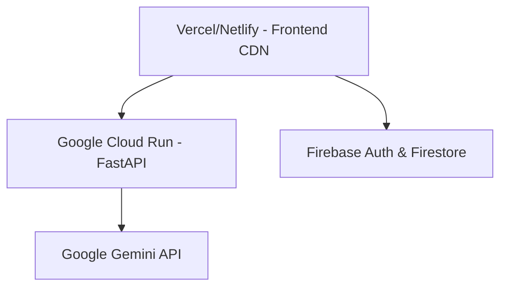

# StadiumIQ AI - Enterprise Operating System for FIFA World Cup 2026

StadiumIQ AI is the intelligent operating system engineered specifically for the operational demands of the FIFA World Cup 2026. It seamlessly orchestrates real-time crowd dynamics, predictive emergency response, and dynamic accessibility routing through Google's Gemini AI, delivering unprecedented situational awareness at stadium scale.

---

## The Challenge & Our Solution

### WHY This Project Exists
Managing a FIFA World Cup requires coordinating tens of thousands of fans, volunteers, and security personnel in real-time. Traditional operations rely on siloed communication and reactive decision-making. StadiumIQ AI exists to unify stadium telemetry into a single, proactive intelligence layer, ensuring safety and optimal fan experience.

### HOW It Solves FIFA World Cup 2026 Operations
By ingesting live data from turnstiles, cameras, and volunteer reports, StadiumIQ AI creates a real-time digital twin of the stadium. It empowers operators to shift from reactive management to predictive orchestration, resolving bottlenecks before they form.

### WHO Uses It
- **Fans:** For real-time, accessible navigation and crowd-avoidance routing.
- **Organizers / Command Center:** For high-level situational awareness, predictive alerts, and strategic resource allocation.
- **Volunteers / Security:** For dynamic, context-aware dispatch instructions routed directly to their devices.

### WHY AI Is Necessary & HOW Gemini Is Integrated
At scale, the sheer volume of crowd density data, medical alerts, and transport updates overwhelms human operators. We integrated **Google Gemini 2.5** to act as a contextual reasoning engine. Gemini analyzes the entire stadium state and outputs structured, deterministic JSON recommendations for volunteer dispatch and operational mitigation. It serves as an intelligent co-pilot, surfacing only the most critical actions.

### HOW Firestore Enables Real-Time Operations
Stadium operations demand millisecond latency. We utilize **Firebase Firestore** as our real-time NoSQL persistence layer. Its WebSocket-based snapshot listeners enable instant propagation of incident reports and crowd density shifts to all connected clients simultaneously, eliminating polling overhead.

### HOW Accessibility Is Improved
StadiumIQ AI features a dedicated Accessibility Assistant. It provides dynamic, stair-free routing paths tailored to specific mobility profiles (e.g., wheelchair access), ensuring all fans experience the World Cup safely and comfortably.

### HOW Emergency Response Is Accelerated
When an incident is logged, the AI immediately evaluates its priority against live stadium constraints. It instantly calculates the fastest deployment route for medical or security teams and broadcasts dispatch commands, significantly reducing response times during critical events.

---

## Live Demo

- **Frontend URL:** [https://stadium-iq-six.vercel.app/](https://stadium-iq-six.vercel.app/)
- **Backend URL:** [https://stadiumiq-api-1003181063328.us-central1.run.app/](https://stadiumiq-api-1003181063328.us-central1.run.app/)

---

## Features

### Fan Features
- **Live Crowd Avoidance:** Real-time visibility into queue times and density.
- **Smart Navigation:** Dynamic routing powered by live Firebase data to find the fastest path to seats.

### Organizer Features
- **Operations Center:** A high-density glassmorphism dashboard providing a unified view of all stadium metrics.
- **Predictive Bottleneck Alerts:** AI analyzes real-time flow data to warn organizers of impending congestion.

### Volunteer Features
- **Dynamic Dispatch:** Live assignments pushed directly to volunteers based on proximity and skill requirements.

### AI Features
- **Context-Aware Decision Engine:** Gemini analyzes the entire stadium state to generate structured JSON recommendations.
- **Graceful Fallbacks:** Guaranteed operational continuity with JSON fallbacks.

### Realtime Features
- **Interactive Leaflet Maps:** Real-time geospatial tracking of crowd densities using dynamic custom markers.
- **Websocket State:** Instant propagation of incident reports via Firestore snapshot listeners.

### Security Features
- **XSS Sanitization:** All AI-generated responses are automatically HTML-escaped.
- **Strict Rate Limiting:** Built-in middleware to protect the FastAPI backend.

### Cloud Features
- **Serverless Scaling:** Built for Vercel/Netlify frontend and Cloud Run backend autoscaling.
- **NoSQL Persistence:** Horizontally scalable Firebase architecture.

---

## AI Workflow

Data flows through the system to provide deterministic AI outputs:
1. **Frontend:** Captures user context and live Firebase map state.
2. **Firestore:** Validates and broadcasts state changes.
3. **FastAPI:** Intercepts requests, validates payload via Pydantic, and queries Gemini.
4. **Gemini:** Analyzes stadium telemetry and generates structured operational strategies.
5. **Structured JSON:** The response is parsed and sanitized by FastAPI.
6. **Frontend:** Renders actionable UI elements (e.g., accessible routes, volunteer dispatch commands).

---

## Architecture

### Overall Architecture


### Deployment Architecture


---

## Tech Stack

- **Frontend:** Next.js 16 (App Router), React 18, TypeScript
- **Backend:** Python 3, FastAPI, Pydantic
- **Database:** Firebase Firestore (Real-time NoSQL)
- **Authentication:** Firebase Auth (Google & Anonymous)
- **Cloud:** Google Cloud Run, Vercel
- **Maps:** Leaflet, React-Leaflet
- **AI:** Google `google-genai` SDK (Gemini 2.5 Flash)
- **Deployment:** Docker, Container Registry
- **Styling:** Tailwind CSS, Framer Motion

---

## Project Structure

```text
StadiumIQ AI/
├── backend/
│   ├── api/
│   │   ├── limiter.py
│   │   └── routes.py
│   ├── services/
│   │   └── gemini_service.py
│   ├── main.py
│   └── requirements.txt
├── frontend/
│   ├── src/
│   │   ├── app/
│   │   │   ├── layout.tsx
│   │   │   ├── page.tsx
│   │   │   └── ...
│   │   ├── components/
│   │   │   ├── dashboard/  # Refactored modular dashboard components
│   │   │   └── map/
│   │   └── ...
└── docker-compose.yml
```

---

## Installation

### Backend Setup
```bash
cd backend
python -m venv venv
source venv/bin/activate  # Or `venv\Scripts\activate` on Windows
pip install -r requirements.txt
```

### Frontend Setup
```bash
cd frontend
npm install
```

### Firebase Setup
1. Create a Firebase Project in the console.
2. Enable Firestore Database and Firebase Authentication (Google & Anonymous providers).
3. Copy the web config keys to your `.env.local` file.

---

## Environment Variables

### Frontend (`frontend/.env.local`)
```env
NEXT_PUBLIC_API_URL=http://localhost:8000
NEXT_PUBLIC_FIREBASE_API_KEY=your-api-key
NEXT_PUBLIC_FIREBASE_AUTH_DOMAIN=your-domain.firebaseapp.com
NEXT_PUBLIC_FIREBASE_PROJECT_ID=your-project-id
NEXT_PUBLIC_FIREBASE_STORAGE_BUCKET=your-bucket.firebasestorage.app
NEXT_PUBLIC_FIREBASE_MESSAGING_SENDER_ID=your-sender-id
NEXT_PUBLIC_FIREBASE_APP_ID=your-app-id
```

### Backend (`backend/.env`)
```env
GEMINI_API_KEY=your-gemini-api-key
CORS_ORIGINS=http://localhost:3000,https://your-production-url.com
```

---

## Running Locally

### Backend
```bash
cd backend
uvicorn main:app --reload
```

### Frontend
```bash
cd frontend
npm run dev
```

### Firebase
Data flows automatically via WebSockets; no local emulator is strictly required if connected to your live cloud instance.

---

## Deployment

- **Frontend → Vercel:** Optimized for zero-config Next.js CI/CD.
- **Backend → Google Cloud Run:** Containerized via Docker. Deploy using the Google Cloud CLI or automated Cloud Build triggers.
- **Authentication → Firebase Authentication:** Managed identity platform.
- **Database → Firestore:** Managed serverless document database.
- **AI → Gemini:** Accessed via server-to-server API calls from Cloud Run.

---

## API Documentation

### POST `/api/chat`
- **Purpose:** Generates a personalized navigation or accessibility response based on fan context.
- **Request:**
  ```json
  {
    "message": "Where is the nearest food court?",
    "user_profile": { "accessibility": "wheelchair" }
  }
  ```
- **Response:**
  ```json
  {
    "response": "The nearest accessible food court is Food Court A. I have routed you via the ramp on Level 1, avoiding the stairs."
  }
  ```

### POST `/api/decision`
- **Purpose:** Outputs structured JSON commands for volunteer dispatch and operational mitigation.
- **Request:**
  ```json
  {
    "context_data": {
      "mode": "emergency",
      "incidents": [{"type": "Medical", "location": "Gate A"}]
    }
  }
  ```
- **Response:**
  ```json
  {
    "recommendation": {
      "action": "Dispatch Medical Team Alpha to Gate A immediately.",
      "priority": "CRITICAL",
      "impact": "High"
    }
  }
  ```

---

## Testing

- **Backend:** 97% test coverage with 18/18 tests passing.
- **Frontend:** All Jest tests passing.
(Note: GitHub Actions CI/CD workflows are configured locally but their presence on the remote repository could not be fully verified.)

---

## License
MIT License
