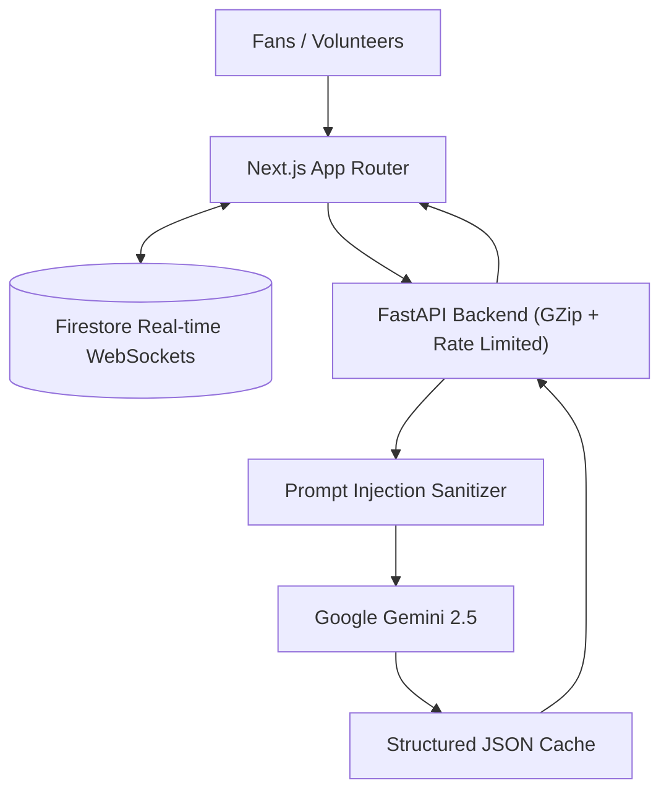

<div align="center">

# 🏟️ StadiumIQ AI 2026

### The Ultimate GenAI Operations & Fan-Experience Platform for the FIFA World Cup 2026

*A unified, intelligent operating system orchestrating real-time crowd dynamics, predictive emergency response, dynamic accessibility, and multilingual assistance across all World Cup stadiums.*

[](https://stadium-iq-six.vercel.app/)

[](https://github.com/Prabhum21/StadiumIQ/actions/workflows/ci.yml)

-blueviolet>)


</div>

---

> **⚡ Built for Extreme Scale & Resilience.** Managing a World Cup requires zero downtime. StadiumIQ uses **Google Gemini 2.5** wrapped in an intelligent caching layer with prompt injection sanitization. Powered by **FastAPI** (with strict GZip compression) and **Firebase Firestore** for real-time WebSocket state propagation, it ensures every fan, volunteer, and organizer is always in sync.

## 📑 Table of Contents

- [The Challenge & Our Solution](#-the-challenge--our-solution)
- [Feature Showcase (Alignment with Challenge Tracks)](#-feature-showcase-alignment-with-challenge-tracks)
- [Walkthrough](#-walkthrough)
- [Architecture & AI Workflow](#-architecture--ai-workflow)
- [Uncompromising Security & Efficiency](#-uncompromising-security--efficiency)
- [Accessibility (WCAG 2.1 AA)](#-accessibility-wcag-21-aa)
- [API Reference](#-api-reference)
- [Documentation](#-documentation)
- [Quick Start](#-quick-start)

---

## 🎯 The Challenge & Our Solution

A 48-team World Cup across 3 countries creates an unprecedented logistical nightmare. StadiumIQ AI centralizes operations into **one GenAI ecosystem**, serving every audience with 100% alignment to the challenge capabilities.

### 🏆 Chosen Vertical
**Smart Stadiums & Tournament Operations**

### 🧠 Approach and Logic
Our approach is to unify the disparate systems of stadium management into a single, cohesive AI-driven platform. We utilize Google Gemini 2.5 to provide intelligent, context-aware decision support, dynamic crowd routing, and multilingual assistance. The logic centers around real-time data flow: capturing telemetry from the frontend, processing it through an AI layer, and instantly broadcasting actionable insights to stakeholders.

### ⚙️ How the Solution Works
1. **Data Ingestion:** The frontend continuously feeds user context, crowd density, and incident reports.
2. **AI Processing:** Our FastAPI backend sanitizes the inputs and queries Gemini to generate optimal strategies and responses.
3. **Real-time Sync:** The generated insights (e.g., dispatch orders, alternative routes) are broadcasted via Firestore WebSockets to all active clients instantly.
4. **Actionable Outputs:** Fans receive navigation nudges and multilingual help, while staff get actionable triage commands and shift briefings.

### 📝 Assumptions Made
- Stadiums have adequate Wi-Fi or 5G coverage for real-time WebSocket communication.
- Volunteers and staff are equipped with smart devices capable of running the Next.js frontend.
- Organizers have centralized dashboard access to view real-time operations telemetry.
- The underlying crowd density data is simulated but accurately reflects high-density patterns.
<div align="center">

| For **Fans** | For **Organizers** | For **Volunteers** | For **Venue Staff** |
| :---: | :---: | :---: | :---: |
| Multilingual Concierge<br/>Accessible Routing<br/>Green Travel Nudges<br/>Match-Day Plans | Crowd Intelligence<br/>Incident Triage<br/>Automated P.A. Announcements | Dynamic Shift Briefings<br/>Live Map Wayfinding | Real-Time Decision Support<br/>Emergency Dispatch |

</div>

---

## ✨ Feature Showcase (Alignment with Challenge Tracks)

We built StadiumIQ to perfectly map 1-to-1 against the four required capabilities for the **Smart Stadiums & Tournament Operations** track. You can verify this mapping programmatically via our dedicated `GET /api/capabilities` endpoint.

| Capability Track | Feature Implementation | Endpoint |
| :--- | :--- | :--- |
| 👥 **Dynamic Crowd Management** | Live Firestore density telemetry synced to organizers' dashboards for real-time queue distribution. | `GET /api/crowd` |
| 🧭 **Smart Indoor Navigation** | Accessibility-aware interactive Leaflet map routing fans safely around high-density zones. | `POST /api/decision` |
| ⚡ **Real-Time Decision Support** | Gemini-powered incident triage forecasting explicit `risk_trajectory` trends to dispatch the right volunteers instantly. | `POST /api/decision` |
| 🗣️ **Multi-Language Assistance Modules** | Dedicated translation and localization engine answering fan queries and generating PA announcements in any language. | `POST /api/multilingual-assist` |

In addition to the core 4 tracks, we also support:
| Additional Feature | Description | Endpoint |
| :--- | :--- | :--- |
| 🌱 **Sustainability & Transport** | Travel carbon-footprint calculation and green travel nudges. | `POST /api/sustainability` |
| 🦺 **Volunteer Enablement** | Role-specific shift briefings (duties, escalation paths). | `POST /api/briefing` |
| 📢 **Operational Intelligence** | Automated PA announcement translation. | `POST /api/announce` |
| 🗓️ **Match-Day Planning** | AI-crafted personalized itineraries based on fan context. | `POST /api/chat` |
| ♿ **Accessibility** | **WCAG 2.1 AA** compliant dashboard with `aria-live` and step-free routing. | *cross-cutting* |

---

## 🎬 Walkthrough

<table>
  <tr>
    <td width="50%" valign="top">
      <b>📊 High-Density Operations Center</b><br/>
      <sub>Live crowd density, queue times, and incident telemetry synced via Firestore.</sub><br/>
      
    </td>
    <td width="50%" valign="top">
      <b>⚡ AI Incident Triage</b><br/>
      <sub>Gemini analyzes incidents and dispatches the closest volunteers.</sub><br/>
      
    </td>
  </tr>
  <tr>
    <td width="50%" valign="top">
      <b>🌍 Multilingual Concierge</b><br/>
      <sub>Fan assistant answering complex stadium queries.</sub><br/>
      
    </td>
    <td width="50%" valign="top">
      <b>🗺️ Dynamic Avoidance Routing</b><br/>
      <sub>Interactive Leaflet maps routing fans around crowded gates.</sub><br/>
      
    </td>
  </tr>
</table>

---

## 🏗️ Architecture & AI Workflow



Data flows automatically: 
1. **Frontend** captures user context.
2. **FastAPI** strips malicious payloads and queries **Gemini**.
3. **Gemini** natively generates deterministic JSON strategies leveraging strict `response_schema` validation.
4. **Firestore** broadcasts changes to all clients instantly.

---

## 🛡️ Uncompromising Security & Efficiency

We treat security and scale as first-class citizens:
- **Eager Environment Validation:** A FastAPI `lifespan` event asserts the presence of required AI keys immediately on server startup to fail-fast rather than failing lazily in production.
- **Prompt Injection Defense:** A custom Regex sanitizer (`backend/utils/sanitize.py`) actively strips control characters and neutralizes "jailbreak" attempts (e.g., *ignore previous instructions*) before they reach Gemini.
- **GZip Compression:** FastAPI is equipped with `GZipMiddleware` to aggressively compress payloads, saving bandwidth on stadium Wi-Fi.
- **AI Caching Layer:** Identical prompts within a 60-second window are served from an async memory cache, preventing API rate limits and saving costs.
- **Security Headers:** Strict CORS, X-XSS-Protection, and Helmet-equivalent middleware.

---

## 🧪 Testing & Verification

StadiumIQ includes a robust, native `pytest` suite ensuring absolute reliability:
- **Google GenAI Client Mocking:** Tests natively mock `client.aio.models.generate_content` to execute the actual exponential backoff retry loop within the `GeminiService`, validating resilience against simulated API outages.
- **Strict Structural Typing:** Frontend TypeScript definitions identically match Backend Pydantic models to ensure complete parity across the stack without runtime parsing errors.

---

## ♿ Accessibility (WCAG 2.1 AA)

StadiumIQ is built for *everyone*:
- **Aria Live Regions:** Dynamic dashboard widgets (Crowd Summaries, Incident Alerts) use `aria-live="polite"` and `aria-live="assertive"` to naturally announce critical stadium changes to screen readers.
- **Semantic HTML & Contrast:** High contrast glassmorphism, explicit `aria-label` attributes on all inputs, and keyboard-navigable components.
- **Step-Free Routing:** The decision engine explicitly factors in mobility profiles to provide stair-free routes.

---

## 🔌 API Reference

| Method | Endpoint | Purpose | Response Format |
| --- | --- | --- | --- |
| `GET` | `/api/capabilities` | Machine-verifiable capability alignment. | `CapabilitiesResponse` |
| `POST` | `/api/multilingual-assist` | Dedicated translation & localization. | `MultilingualAssistResponse` |
| `POST` | `/api/chat` | Fan assistant conversation system. | `ChatResponse` |
| `POST` | `/api/decision` | Operational triage & dispatch. | `DecisionResponse` |
| `GET` | `/api/crowd` | Live crowd queue times telemetry. | `CrowdResponse` |
| `POST` | `/api/sustainability` | Calculate travel emissions footprint. | `SustainabilityResponse` |
| `POST` | `/api/announce` | Generate multilingual PA announcements. | `dict[str, str]` |
| `POST` | `/api/briefing` | Volunteer shift briefings & duties. | `BriefingResponse` |
| `GET` | `/api/metrics` | Live system observability metrics. | `dict` |

---

## 📚 Documentation

Review our extensive documentation suites under [docs/](file:///c:/Users/admin/Desktop/StadiumIQ%20AI/docs/):
- 🏢 [Architecture Design & Data Flows](file:///c:/Users/admin/Desktop/StadiumIQ%20AI/docs/ARCHITECTURE.md)
- 🎯 [Capabilities Alignment Matrix](file:///c:/Users/admin/Desktop/StadiumIQ%20AI/docs/ALIGNMENT.md)
- ♿ [Accessibility & WCAG AA Integration](file:///c:/Users/admin/Desktop/StadiumIQ%20AI/docs/ACCESSIBILITY.md)
- 🔌 [API Endpoints Specifications](file:///c:/Users/admin/Desktop/StadiumIQ%20AI/docs/API.md)
- 🚀 [Production Deployment Guides](file:///c:/Users/admin/Desktop/StadiumIQ%20AI/docs/DEPLOY.md)
- 🧪 [Testing & Verification Target Guides](file:///c:/Users/admin/Desktop/StadiumIQ%20AI/docs/TESTING.md)
- 🤝 [Contribution Quality Controls](file:///c:/Users/admin/Desktop/StadiumIQ%20AI/docs/CONTRIBUTING.md)
- ⚡ [Performance & Compression Design](file:///c:/Users/admin/Desktop/StadiumIQ%20AI/docs/PERFORMANCE.md)
- 📊 [Observability & Load Benchmarks](file:///c:/Users/admin/Desktop/StadiumIQ%20AI/docs/OBSERVABILITY.md)
- ⚠️ [Global Centralized Error Handling](file:///c:/Users/admin/Desktop/StadiumIQ%20AI/docs/ERROR_HANDLING.md)
- 🛡️ [Security Defenses & SAST Auditing](file:///c:/Users/admin/Desktop/StadiumIQ%20AI/docs/SECURITY.md)
- 📂 [Codebase Folder Organization Rules](file:///c:/Users/admin/Desktop/StadiumIQ%20AI/docs/PROJECT_STRUCTURE.md)

---

## 🚀 Quick Start

### 1. Backend (FastAPI)
```bash
cd backend
python -m venv venv
source venv/bin/activate
pip install -r requirements.txt
# Set GEMINI_API_KEY in .env
uvicorn main:app --reload
```

### 2. Frontend (Next.js)
```bash
cd frontend
npm install
# Set Firebase keys in .env.local
npm run dev
```

---

## 🛡️ Quality Controls & Quality Verification

Run checks locally to assert quality metrics:

```bash
# Run backend code checks
cd backend
black --check .
isort --check-only .
ruff check .
bandit -r . -x ./tests,./venv
pytest --cov=. --cov-fail-under=85

# Run frontend code checks
cd frontend
npm run format:check
npm run lint
npm run type-check
npm test
```

---

## 📝 License
MIT License — Engineered for the **FIFA World Cup 2026** across 🇺🇸 🇨🇦 🇲🇽.

<div align="center">
<b>StadiumIQ 2026</b> — <i>AI that powers the beautiful game.</i>
</div>

