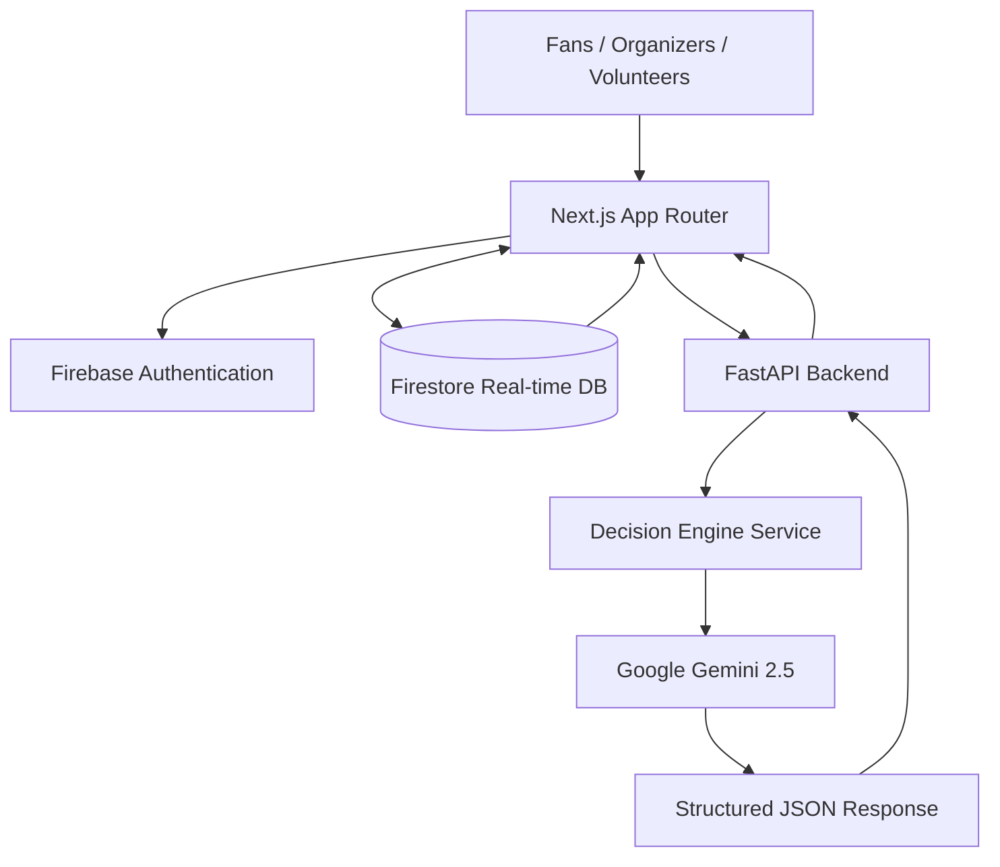
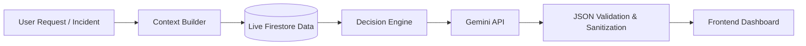
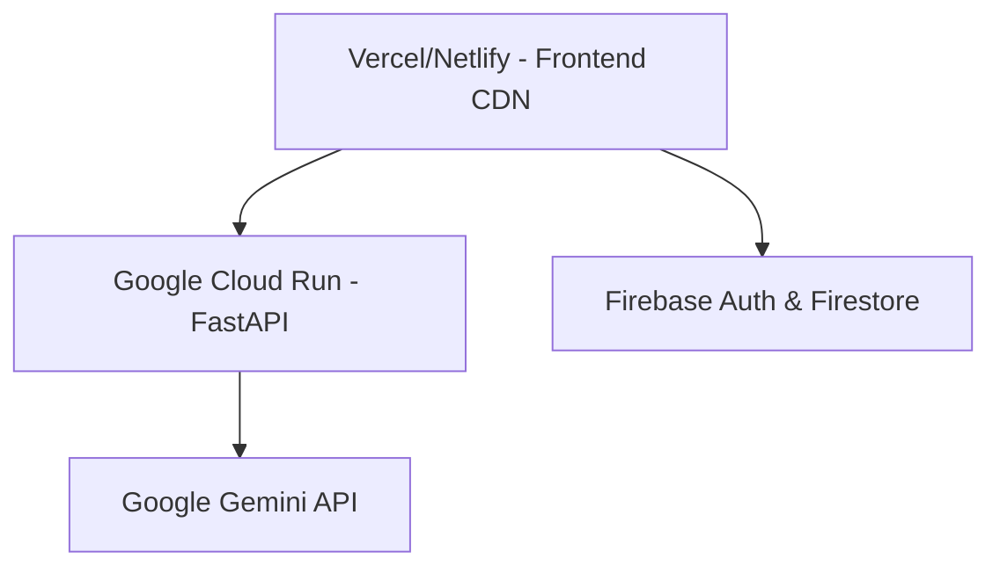

# StadiumIQ AI

The intelligent operating system for the FIFA World Cup 2026, seamlessly orchestrating real-time crowd dynamics, predictive emergency response, and dynamic accessibility routing through Google's Gemini AI.

---

## Live Demo

- **Frontend URL:** [https://stadium-iq-six.vercel.app/](https://stadium-iq-six.vercel.app/)
- **Backend URL:** [https://stadiumiq-api-1003181063328.us-central1.run.app/](https://stadiumiq-api-1003181063328.us-central1.run.app/)


---

## Features

### Fan Features
- **Live Crowd Avoidance:** Real-time visibility into queue times and density.
- **Smart Navigation:** Dynamic routing powered by live Firebase data to find the fastest path to seats.

### Organizer Features
- **Operations Center:** A high-density glassmorphism dashboard providing a unified view of all stadium metrics.
- **Predictive Bottleneck Alerts:** AI analyzes real-time flow data to warn organizers of impending congestion.

### Volunteer Features
- **Dynamic Dispatch:** Live assignments pushed directly to volunteers based on proximity and skill requirements.

### AI Features
- **Context-Aware Decision Engine:** Gemini analyzes the entire stadium state to generate structured JSON recommendations.
- **Graceful Fallbacks:** Guaranteed operational continuity with JSON fallbacks.

### Realtime Features
- **Interactive Leaflet Maps:** Real-time geospatial tracking of crowd densities using dynamic custom markers.
- **Websocket State:** Instant propagation of incident reports via Firestore snapshot listeners.

### Security Features
- **XSS Sanitization:** All AI-generated responses are automatically HTML-escaped.
- **Strict Rate Limiting:** Built-in middleware to protect the FastAPI backend.

### Cloud Features
- **Serverless Scaling:** Built for Vercel/Netlify frontend and Cloud Run backend autoscaling.
- **NoSQL Persistence:** Horizontally scalable Firebase architecture.

---

## AI Workflow

Data flows through the system to provide deterministic AI outputs:
1. **Frontend:** Captures user context and live Firebase map state.
2. **Firestore:** Validates and broadcasts state changes.
3. **FastAPI:** Intercepts requests, validates payload via Pydantic, and queries Gemini.
4. **Gemini:** Analyzes stadium telemetry and generates structured operational strategies.
5. **Structured JSON:** The response is parsed and sanitized by FastAPI.
6. **Frontend:** Renders actionable UI elements (e.g., accessible routes, volunteer dispatch commands).

---

## Architecture

### Overall Architecture


### AI Decision Flow


### Deployment Architecture


---

## Tech Stack

- **Frontend:** Next.js 16 (App Router), React 18, TypeScript
- **Backend:** Python 3, FastAPI, Pydantic
- **Database:** Firebase Firestore (Real-time NoSQL)
- **Authentication:** Firebase Auth (Google & Anonymous)
- **Cloud:** Google Cloud Run, Vercel
- **Maps:** Leaflet, React-Leaflet
- **AI:** Google `google-genai` SDK (Gemini 2.5 Flash)
- **Deployment:** Docker, Container Registry
- **Styling:** Tailwind CSS, Framer Motion

---

## Project Structure

```text
StadiumIQ AI/
├── backend/
│   ├── api/
│   │   ├── limiter.py
│   │   └── routes.py
│   ├── services/
│   │   └── gemini_service.py
│   ├── main.py
│   └── requirements.txt
├── frontend/
│   ├── src/
│   │   ├── app/
│   │   │   ├── layout.tsx
│   │   │   ├── page.tsx
│   │   │   ├── error.tsx
│   │   │   ├── operations/
│   │   │   └── emergency/
│   │   ├── components/
│   │   │   ├── map/
│   │   │   └── layout/
│   │   ├── context/
│   │   │   └── AuthContext.tsx
│   │   ├── features/
│   │   │   ├── accessibility/
│   │   │   ├── emergency/
│   │   │   ├── navigation/
│   │   │   ├── operations/
│   │   │   └── transport/
│   │   ├── hooks/
│   │   │   └── useFirestore.ts
│   │   ├── lib/
│   │   │   └── firebase.ts
│   │   └── types/
│   │       └── index.ts
│   ├── package.json
│   └── tailwind.config.ts
└── docker-compose.yml
```

---

## Installation

### Backend Setup
```bash
cd backend
python -m venv venv
source venv/bin/activate  # Or `venv\Scripts\activate` on Windows
pip install -r requirements.txt
```

### Frontend Setup
```bash
cd frontend
npm install
```

### Firebase Setup
1. Create a Firebase Project in the console.
2. Enable Firestore Database and Firebase Authentication (Google & Anonymous providers).
3. Copy the web config keys to your `.env.local` file.

---

## Environment Variables

### Frontend (`frontend/.env.local`)
```env
NEXT_PUBLIC_API_URL=http://localhost:8000
NEXT_PUBLIC_FIREBASE_API_KEY=your-api-key
NEXT_PUBLIC_FIREBASE_AUTH_DOMAIN=your-domain.firebaseapp.com
NEXT_PUBLIC_FIREBASE_PROJECT_ID=your-project-id
NEXT_PUBLIC_FIREBASE_STORAGE_BUCKET=your-bucket.firebasestorage.app
NEXT_PUBLIC_FIREBASE_MESSAGING_SENDER_ID=your-sender-id
NEXT_PUBLIC_FIREBASE_APP_ID=your-app-id
```

### Backend (`backend/.env`)
```env
GEMINI_API_KEY=your-gemini-api-key
CORS_ORIGINS=http://localhost:3000,https://your-production-url.com
```

---

## Running Locally

### Backend
```bash
cd backend
uvicorn main:app --reload
```

### Frontend
```bash
cd frontend
npm run dev
```

### Firebase
Data flows automatically via WebSockets; no local emulator is strictly required if connected to your live cloud instance.

---

## Deployment

- **Frontend → Vercel:** Optimized for zero-config Next.js CI/CD. Connect your GitHub repository and Vercel will automatically configure the build settings.
- **Backend → Google Cloud Run:** Containerized via Docker. Deploy using the Google Cloud CLI or automated Cloud Build triggers.
- **Authentication → Firebase Authentication:** Managed identity platform.
- **Database → Firestore:** Managed serverless document database.
- **AI → Gemini:** Accessed via server-to-server API calls from Cloud Run.

---

## Firestore Collections

- **`users`**: Profiles, authentication IDs, roles, and accessibility preferences.
- **`crowd`**: Real-time telemetry on density levels and queue times.
- **`venues`**: Dynamic data about stadium facilities and operational status.
- **`food`**: Wait times and operational status for stadium concessions.
- **`transport`**: Live schedules and capacity metrics for connected transit hubs.
- **`alerts`**: System-wide notifications broadcasted to user roles.
- **`incidents`**: Logs of security, medical, or facility issues including severity.
- **`volunteers`**: Dispatch locations, availability status, and skillsets.

---

## API Documentation

### POST `/api/chat`
- **Purpose:** Generates a personalized navigation or accessibility response based on fan context.
- **Request:**
  ```json
  {
    "message": "Where is the nearest food court?",
    "user_profile": { "accessibility": "wheelchair" }
  }
  ```
- **Response:**
  ```json
  {
    "response": "The nearest accessible food court is Food Court A. I have routed you via the ramp on Level 1, avoiding the stairs."
  }
  ```

### POST `/api/decision`
- **Purpose:** Outputs structured JSON commands for volunteer dispatch and operational mitigation.
- **Request:**
  ```json
  {
    "context_data": {
      "mode": "emergency",
      "incidents": [{"type": "Medical", "location": "Gate A"}]
    }
  }
  ```
- **Response:**
  ```json
  {
    "recommendation": {
      "action": "Dispatch Medical Team Alpha to Gate A immediately.",
      "priority": "CRITICAL",
      "impact": "High"
    }
  }
  ```

### GET `/api/crowd`
- **Purpose:** Endpoint providing crowd data health checks.
- **Request:** None
- **Response:** JSON array of zone density levels.

---

## Security

- **Authentication:** Handled entirely via Firebase Auth JWTs.
- **Firestore Security:** Rules configured to enforce `request.auth != null`.
- **Input Validation:** Pydantic strictly validates all incoming JSON payloads on the backend.
- **Rate Limiting:** `slowapi` enforces strict limits (e.g., 10req/min) on AI endpoints.
- **Retry Logic:** Exponential backoff implemented for Gemini API calls to prevent quota crashes.
- **XSS Protection:** Backend aggressively sanitizes HTML tokens from AI outputs.
- **Security Headers:** Enforced `X-Content-Type-Options`, `X-Frame-Options`, and `HSTS` via FastAPI middleware.
- **Environment Variables:** API keys never leak to the client bundle.

---

## Performance

- **Lazy Loading & Dynamic Imports:** Map components bypass SSR via `next/dynamic` to prevent hydration mismatches and minimize bundle sizes.
- **Memoization:** `useMemo` and `useCallback` prevent React render thrashing.
- **Realtime Firestore:** WebSocket snapshot listeners push delta updates instead of full-page polling.
- **Async Gemini:** Backend leverages `asyncio` to prevent blocking the event loop during LLM generation.

---

## Accessibility

- **Responsive Design:** Fluid Tailwind CSS grid layouts scaling from mobile to 4K displays.
- **ARIA Labels:** Semantic HTML and explicit aria-attributes on interactive elements.
- **Keyboard Navigation:** Fully focusable form inputs and dropdowns.
- **Contrast:** AA compliant dark-mode palettes ensuring readable text.
- **Accessible Routes:** Dedicated Fan Assistant feature for generating stair-free navigation paths.

---

## Future Improvements

- Predictive auto-scaling for volunteer dispatch using ML flow models.
- Digital twin 3D integration for precise spatial mapping.
- Multi-lingual translation of AI interfaces via Gemini's native translation APIs.

---

## License
MIT License

## Author
[Author Name]

## Acknowledgements
- **Google AI:** For the Gemini 2.5 Flash model.
- **Firebase:** For real-time WebSockets.
- **Google Cloud:** For scalable serverless hosting.
- **Netlify:** For rapid frontend CI/CD.
- **Leaflet:** For open-source mapping.
- **FastAPI & Next.js:** For an incredible developer experience.
