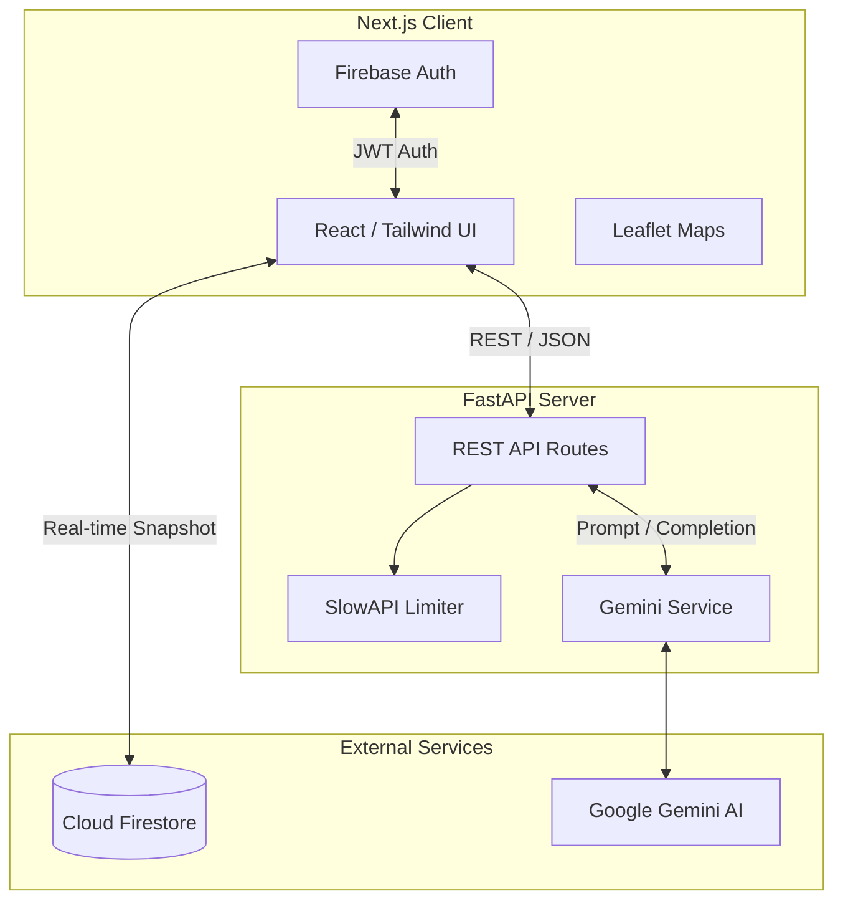

# StadiumIQ 🏟️

> FIFA World Cup 2026 Smart Stadium AI Platform

[](https://github.com/Prabhum21/StadiumIQ)
[](https://github.com/Prabhum21/StadiumIQ)
[](https://github.com/Prabhum21/StadiumIQ)
[](https://opensource.org/licenses/MIT)

## 📌 Project Overview
StadiumIQ is an AI-powered smart stadium operations platform designed for the FIFA World Cup 2026. It leverages real-time data, predictive AI, and cloud technologies to optimize crowd control, emergency response, accessible routing, and live event management.

## 🎯 Problem Statement
Managing mega-events like the FIFA World Cup requires coordinating massive crowds, diverse accessibility needs, and instantaneous emergency responses. Traditional siloed systems fail to provide proactive, intelligent insights. StadiumIQ solves this by unifying real-time stadium metrics with generative AI to produce actionable operational intelligence.

## 🏗️ Architecture



## 🛠️ Technology Stack

- **Frontend:** Next.js, React, TypeScript, Tailwind CSS, Framer Motion, Leaflet
- **Backend:** FastAPI, Python, Pydantic, SlowAPI
- **Cloud & AI:** Firebase (Auth, Firestore), Google Gemini AI, Google Cloud Run

## ✨ Features
- **Real-Time Crowd Intelligence:** Live density mapping and queue time estimates.
- **AI Decision Engine:** Gemini-powered recommendations for operational bottlenecks.
- **Emergency Command Center:** Automated volunteer dispatch and incident tracking.
- **Accessibility Routing:** Tailored navigation for fans with mobility requirements.
- **Transport Intelligence:** Live updates on metro, bus, and parking availability.

## 🚀 Installation & Local Development

### 1. Clone the repository
```bash
git clone https://github.com/Prabhum21/StadiumIQ.git
cd StadiumIQ
```

### 2. Frontend Setup
```bash
cd frontend
npm install
# Create a .env.local file using the provided .env.example
npm run dev
```

### 3. Backend Setup
```bash
cd backend
python -m venv venv
source venv/bin/activate  # On Windows: venv\Scripts\activate
pip install -r requirements.txt
# Create a .env file using the provided .env.example
uvicorn main:app --reload
```

## 🔐 Environment Variables
Copy `.env.example` to `.env` in the backend and `.env.local` in the frontend. You will need:
- `GEMINI_API_KEY` (Backend)
- `NEXT_PUBLIC_FIREBASE_*` credentials (Frontend)

## 📦 Docker Deployment
A `docker-compose.yml` is provided for full-stack deployment:
```bash
docker-compose up --build
```

## 🌐 API Endpoints
- `GET /api/health` - System health check
- `GET /api/crowd` - Live crowd metrics (Rate Limited: 30/min)
- `POST /api/chat` - Fan Assistant interactions
- `POST /api/decision` - Operations Center AI recommendations

## 📂 Folder Structure
```text
StadiumIQ/
├── backend/
│   ├── api/          # FastAPI Routes & Limiter
│   ├── schemas/      # Pydantic validation models
│   ├── services/     # Gemini AI core logic
│   ├── tests/        # Pytest suites
│   └── main.py       # ASGI Entrypoint & Middleware
├── frontend/
│   ├── src/
│   │   ├── app/      # Next.js Pages
│   │   ├── components/ # Shared React UI
│   │   ├── config/   # Environment config
│   │   ├── features/ # Domain-specific modules
│   │   └── hooks/    # Custom React hooks
│   └── __tests__/    # Jest/RTL tests
└── docker-compose.yml
```

## 🛡️ Security
- **Rate Limiting:** Protects heavy endpoints from DoS.
- **Input Validation:** Strict Pydantic max-length validations.
- **Prompt Hardening:** Hardened Gemini prompts to prevent injection attacks.
- **HTTP Headers:** Strict CSP, Referrer-Policy, and X-XSS-Protection.

## ♿ Accessibility (a11y)
- Fully keyboard-navigable interface.
- ARIA labels on dynamic notifications and icons.
- Semantic HTML tags (`<nav>`, `<aside>`, `<button>`).
- Jest-Axe automated accessibility audits in CI.

## ⚡ Performance Optimizations
- **Frontend:** Extensive `useMemo` utilization for expensive metrics, `React.memo` for Leaflet map component rendering optimization, and dynamic component loading.
- **Backend:** Middleware string-parsing optimization, unified LLM client caching, and deduplicated service execution pipelines.

## 🧪 Testing
The repository includes extensive testing covering both backend and frontend layers:
```bash
# Backend
cd backend && pytest --cov

# Frontend
cd frontend && npm run test
```

## 🔮 Future Improvements
- **WebSockets:** Migrate Firestore polling/snapshots to unified WebSocket streams for the dashboard.
- **Redis Caching:** Introduce caching for non-critical AI decision routes.
- **Mobile App:** Wrap the responsive PWA into a React Native application.

---
*Built for the FIFA World Cup 2026 Smart Stadium Challenge.*
