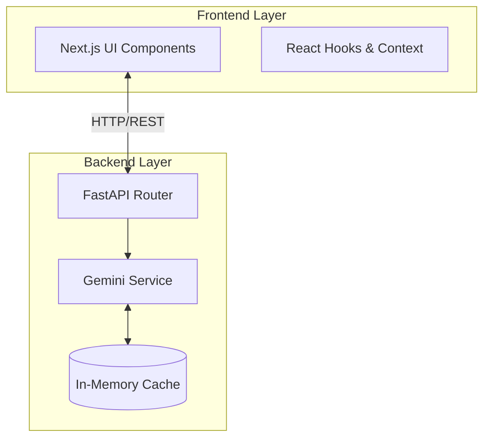
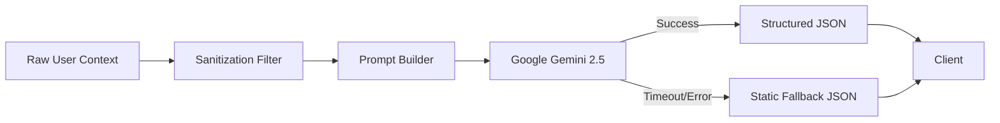
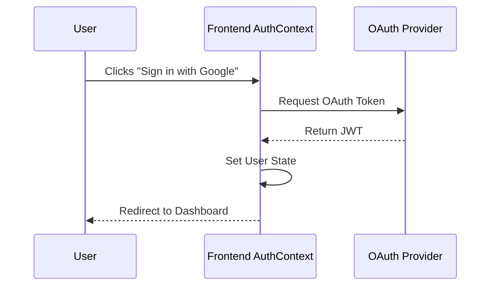
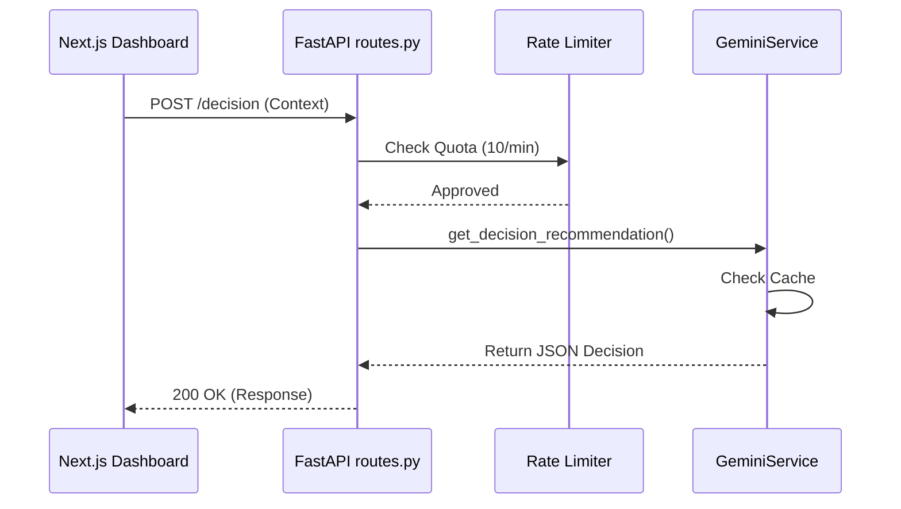
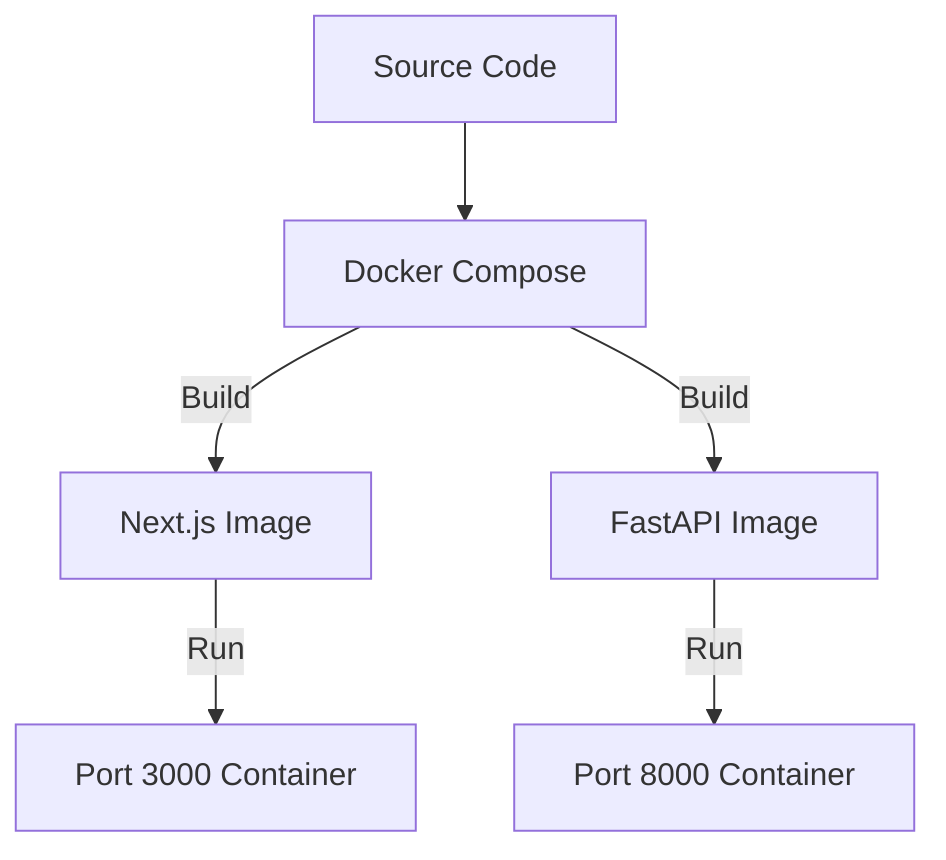
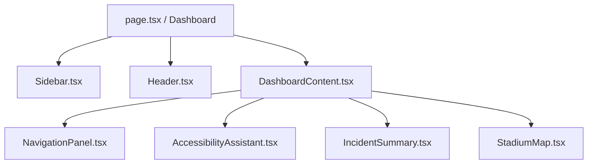
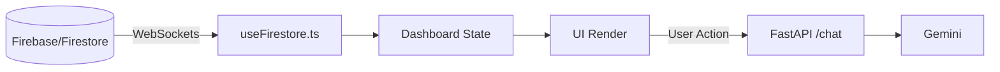

# System Architecture & Diagrams

## Purpose
The purpose of StadiumIQ is to provide a highly scalable, decoupled architecture that manages real-time stadium operations, fan navigation, and generative AI integrations. This document provides a visual and technical breakdown of the system layers.

---

## 1. Overall Architecture
Demonstrates the separation of concerns between the Client (Next.js) and Server (FastAPI).

---

## 2. AI Pipeline
Details the prompt sanitization and fallback mechanisms for the Generative AI engine.

---

## 3. Authentication Flow
Outlines the guest and authenticated user flows. *(Note: Auth logic lives in `AuthContext.tsx` on the client side).*

---

## 4. Request Flow
Traces a specific API call (e.g., `/decision`) from client to server.

---

## 5. Deployment Flow
Illustrates the containerized build and execution process.

---

## 6. Component Hierarchy
Displays the structural rendering tree of the frontend React application.

---

## 7. Data Flow
Shows how data is persisted and passed through the application state.

---

## Implementation & Evidence
- **Frontend Layer**: `frontend/src/app/page.tsx`, `frontend/src/context/AuthContext.tsx`.
- **Backend Layer**: `backend/api/routes.py`, `backend/services/gemini_service.py`.
- **Deployment**: `docker-compose.yml`, `backend/Dockerfile`, `frontend/Dockerfile`.

## Tradeoffs
The architecture strongly favors decoupling (React vs FastAPI). While this introduces network latency between the frontend and backend compared to a monolithic Next.js Server Actions approach, it allows the heavy Python ML/AI ecosystem to be isolated and scaled independently.

## Future improvements
Introduce a message broker (like RabbitMQ or Redis Pub/Sub) in the Data Flow to handle asynchronous incident processing outside of the main HTTP request/response cycle.
