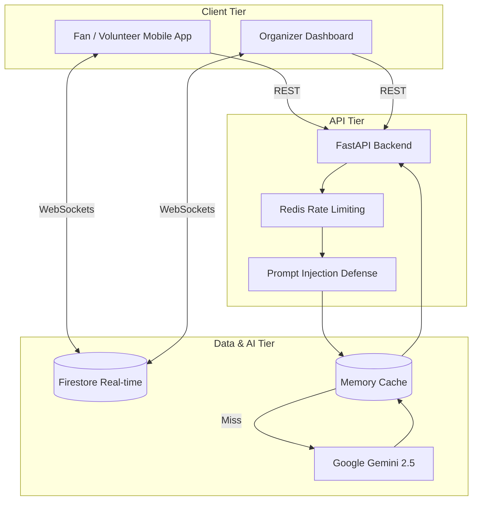

# StadiumIQ Architecture

StadiumIQ relies on a highly concurrent, event-driven architecture optimized for the scale of the FIFA World Cup 2026.

## System Components

### 1. The Frontend (Next.js 14)
Built on the App Router, the Next.js frontend delivers a heavily optimized, responsive PWA experience for both fans (mobile web) and organizers (desktop dashboards).
- **State Management:** Relies on React Context and localized hooks, minimizing global renders.
- **Mapping:** Integrates Leaflet for responsive, layer-based stadium cartography, dynamically overlaying crowd density heatmaps.

### 2. The Real-time Data Layer (Firestore)
Firebase Firestore operates as the central Nervous System for telemetry. 
- WebSockets propagate density spikes, queue time modifications, and security incidents directly to the frontend clients without polling.
- Bypasses the FastAPI backend for pure telemetry, saving API bandwidth.

### 3. The Backend Engine (FastAPI)
A high-throughput Python API handling the heavy lifting of AI orchestration.
- **Performance:** Asynchronous routes (`async def`) run on Uvicorn.
- **Optimization:** Global `GZipMiddleware` compresses heavy JSON payloads (like dense PA text or large itineraries) for congested stadium networks.
- **Resilience:** Integrates exponential backoff retries when interfacing with external LLM APIs.

### 4. The AI Core (Google Gemini 2.5)
Gemini Flash 2.5 powers the deterministic operational decisions and natural language interactions.
- We utilize strict Pydantic schemas (translated to `response_mime_type="application/json"` in the Gemini API call) to force the AI into returning machine-parsable JSON for automated dispatch systems.
- A custom caching layer sits in front of Gemini: identical queries within a 60-second window are served from memory, preventing rate limits and reducing costs during simultaneous crowd queries (e.g., thousands of fans asking "Where is Gate B?").

## Data Flow Diagram

